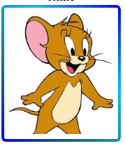

# Anosh Animate 🎉

[](https://github.com/anosh-gem/anosh-animate/blob/main/LICENSE)


**Anosh Animate** is a CSS animation library featuring over 500 stunning animations. This library helps developers add beautiful animations to their web projects effortlessly.

## Features ✨

- **100+ Animations**: A wide variety of animations to bring your website to life.
- **border**: 5 types of border color effect.
- **Easy to Use**: Just add cdn and CSS class and enjoy the animation.
- **Lightweight**: Fast loading with a small file size.
- **Customizable**: Customize animations to fit your needs.

## Installation ⚙️

You can include `anosh-animate` in your project using npm or a CDN.
# NPM

```bash
npm install anosh-animate
```

# CDN example add this code in your html code inside head tag
```bash
<head>
  <link rel="stylesheet" href="https://cdn.jsdelivr.net/gh/anosh-gem/anosh-animate@main/anosh-animmate-min.css">
  <link rel="stylesheet" href="https://cdn.jsdelivr.net/gh/anosh-gem/anosh-animate@main/dist/control/control.css">
  <link rel="stylesheet" href="https://cdn.jsdelivr.net/gh/anosh-gem/anosh-animate@main/dist/root/root.css">
<head>
```
**now you are connected to anosh-animate library you can use all features**


# how to use


### example how to add borders in images you can change **bcolor2, bcolor3, bcolor4, bcolor5**
```bash
<div class="anosh bcolor1" > 
   
 </div>
```
# outputs


<table><tr><th>without border</th><th>bcolor1</th><th>bcolor2</th>  <th>bcolor3</th> <th>bcolor4</th> <th>bcolor5</th></tr>
    <tr>
       <td><div> 
       
     </div></td>
    <td><div class="anosh bcolor1"> 
       
     </div></td>
    <td><div class="anosh bcolor2"> 
       
     </div></td>
    <td><div class="anosh bcolor3"> 
       
     </div></td>
    <td><div class="anosh bcolor4"> 
       
     </div></td>
    <td><div class="anosh bcolor5"> 
       
     </div></td></tr></table><br><br>


 # Here is an example of how I used the bounce animation on an HTML image tag, where "i" stands for infinite.

```bash
   
```

# output


## Animation Names
### Basic Animations
- `blink`
- `pulseGrow`
- `pulseShrink`
- `floatUpDown`
- `floatLeftRight`
- `flicker`
- `shadowPulse`
- `spinSlow`
- `spinReverse`

### Fade and Transition Animations
- `fadeIn`
- `fadeOut`
- `fadeInExpand`
- `dropFade`
- `riseFade`
- `zoomOutFade`
- `zoomInFlip`
- `glideDown`
- `glideUp`
- `slideInDiagonal`
- `slideInLeft`
- `slideInRight`
- `slideInUp`
- `slideInDown`
- `slideOutLeft`
- `slideOutRight`
- `slideOutUp`
- `slideOutDown`

### Rotate and Spin Animations
- `twistIn`
- `twistOut`
- `wave`
- `spinZoom`
- `rotateX`
- `rotateY`
- `spinYFlip`
- `spinXFlip`
- `rotateIn`

### Bounce and Shake Animations
- `bounce`
- `bounceTwist`
- `shakeX`
- `shakeY`
- `headShake`
- `jiggle`
- `wobble`
- `jump`
- `drop`
- `bounceInLeft`
- `bounceInRight`
- `bounceOutLeft`
- `bounceOutRight`
- `bounceTwist`

### Scale and Zoom Animations
- `zoomIn`
- `zoomOut`
- `scaleUp`
- `scaleDown`
- `expandZoom`
- `shrinkZoom`
- `zoomUp`
- `zoomDown`
- `zoomInBounce`
- `zoomOutBounce`

### Skew, Sway, and Tilt Animations
- `sway`
- `jelly`
- `tiltIn`
- `tiltOut`
- `skewIn`
- `skewOut`
- `tiltBounce`
- `tiltScale`
- `swayTwist`
- `waveTilt`

### Rotation and Flip Animations
- `flipInX`
- `flipOutX`
- `flipInY`
- `flipOutY`
- `flipZ`
- `rotateZ`
- `flipInZoom`
- `flipOutZoom`
- `circleSpin`
- `twirl`

### Flash and Flicker Animations
- `flash`
- `flicker`
- `flickerFade`
- `blinkFast`
- `glowPulse`
- `lightFlash`
- `strobe`
- `shadowFlash`
- `twinkle`
- `sparkle`

### Entrance and Exit Animations
- `tada`
- `rubberBand`
- `swing`
- `lightSpeedIn`
- `lightSpeedOut`
- `jello`
- `bounceIn`
- `bounceOut`
- `expandIn`
- `collapseOut`

### Border and Shadow Animations
- `dropShadowPulse`
- `borderGlow`
- `borderFlash`
- `shadowExpand`
- `shadowShrink`
- `borderWave`
- `shadowRotate`
- `borderPop`
- `glowBounce`
- `neonBlink`

free and open source 
